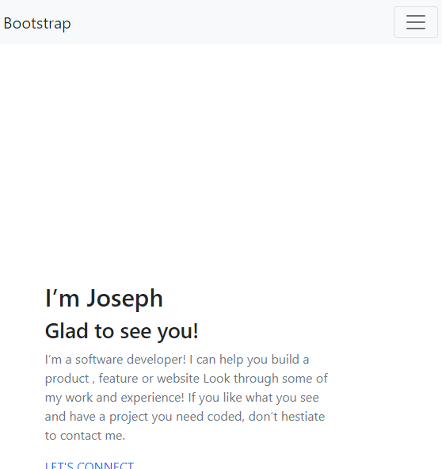
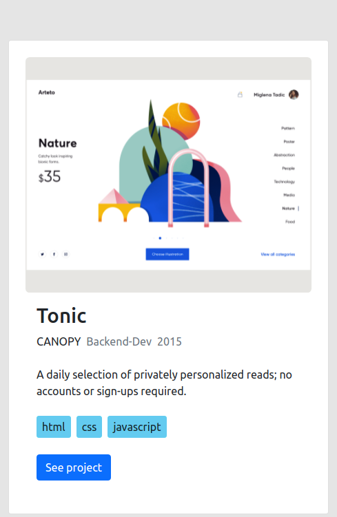
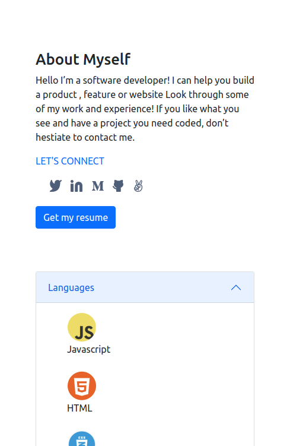
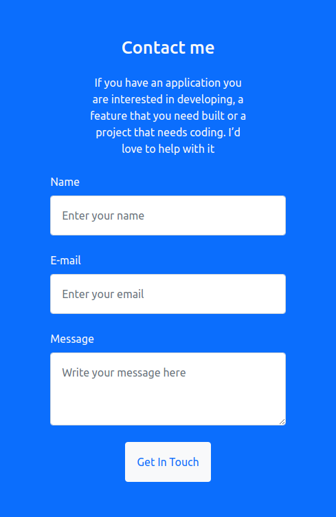

# Bootstrap-Portfolio-Project
In this project, we learned how bootstrap works.

- 
- 
- 
- 

[Live Preview Link]()

## :red_circle: Live Demo

## :hammer: Built With

- HTML and Bootstrap
To get a local copy up and running follow these simple steps:

1. Go to the [repository page](https://github.com/ONJoseph/Bootstrap-portfolio-test).
2. Press the "Code" button and copy the link.
3. Clone it using git command `git clone <link>`.

## :blue_book: Learning Objectives

- Understand the concept of CSS frameworks.
- Use documentation for CSS frameworks.

## 👤 Authors

- GitHub: [ONJoseph](https://github.com/ONJoseph)
- GitHub: [@]()

## Authors

👤 Roger Smit Castillo

- GitHub:https://github.com/latinogan
- Email:roger.castillo.arce@gmail.com 
- LinkedIn: [LinkedIn](https://www.linkedin.com/in/roger-smith-a35738179/)

## 🤝 :raised_hand: :raised_hand: Contributions

Contributions, issues, and feature requests are welcome!

Feel free to check the [issues page](https://github.com/ONJoseph/Bootstrap-portfolio-test/issues).

## Acknowledgments

- Thanks to Microverse

## 📝 License

This project is [MIT](LICENSE) licensed.
